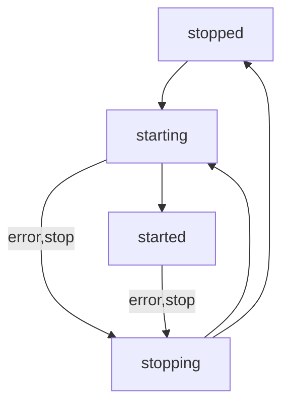

# Invariants

- No cycles.

- All upstreams always exist, and therefore all downstreams also always exist.

- Short tasks with non-none started actions cannot have downstreams

# Events

Whenever an event happens (ipc on/off, process launched, startup check passes, process exits), the following happens:

1. Update `Actual`
2. Plan graph changes
3. Execute graph changes

# `Actual` flow

