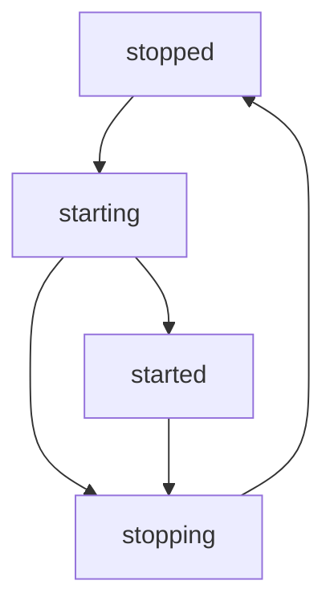
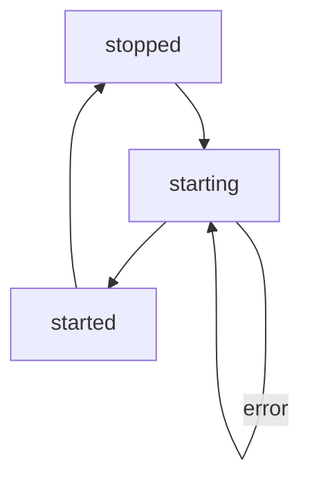

# Invariants

- No cycles.

- All upstreams always exist, and therefore all downstreams also always exist.

- Short tasks with non-none started actions cannot have downstreams

# Status flow, long task

# Status flow, short task

